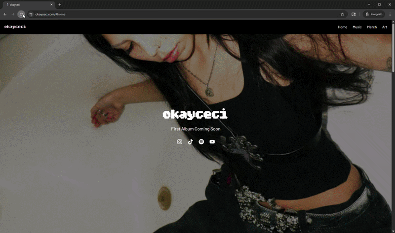

# Singer Portfolio Website

A responsive portfolio website for a singer, built with React, Vite, and Tailwind CSS.  
The site features smooth animations, modern UI components, and a mobile-first design.


---

## Live Demo
[Visit the website](https://www.okayceci.com)



---

## Features
- Fully responsive design (mobile-first, works across all screen sizes)
- Smooth animations with Framer Motion for engaging UI transitions
- Custom branding including favicon and site meta
- Modern UI built with Tailwind CSS components
- SEO optimized with proper meta tags
- Deployed on Vercel with a custom domain

---

## Tech Stack
- **Frontend:** React, Vite
- **Styling:** Tailwind CSS
- **Animations:** Framer Motion
- **Deployment:** Vercel
- **Other Tools:** Favicon.io for custom icons

---

## Installation / Local Development

To run this project locally:

### 1. Clone the repository
```bash
git clone https://github.com/username/singer-website.git
cd singer-website
```
### 2. Install dependencies 
```bash
npm install 
```
### 3. Start the dev server
```bash
npm run dev
```
Then open: http://localhost:5173

## Lessons Learned
- Implemented smooth animations without sacrificing performance
- Applied mobile-first responsive design principles using Tailwind CSS
- Learned deployment workflows with Vercel and custom domain management
- Improved UX through interactive UI elements and consistent branding

## Future Improvements in Progress
- Building out the Merch and Art pages of the site
- Updating the icons being used
